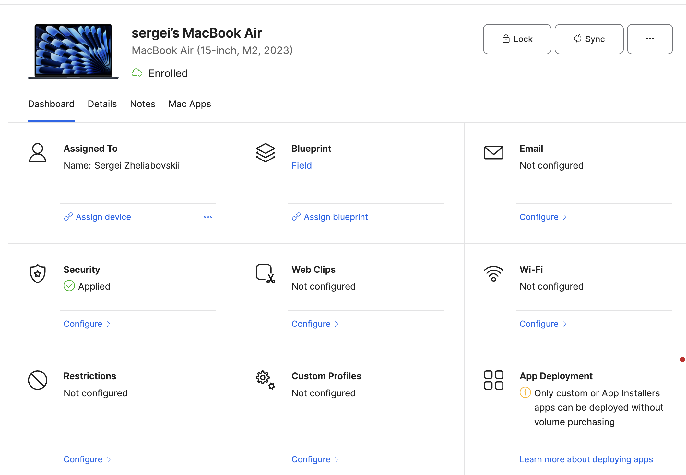

# Jamf Now Bootstrap (Manual Onboarding)

This repo provides a **manual, user‑initiated** bootstrap for macOS devices using **Jamf Now Open Enrollment**. It installs the Jamf enrollment profile (if you provide an Open Enrollment URL or a local profile file) and applies a local security baseline via `.mobileconfig` profiles. It also enables core hardening (firewall, Gatekeeper, password policy, FileVault defer) and writes clear logs.

> Need fully automated zero‑touch (DEP/ABM + Jamf Pro)? Use the separate project:
> **[jamf\_pro\_bootstrap](https://github.com/LebovskiiS/jamf_pro_bootstrap)**

---

## What this is / isn’t

**This is:**

* A local bootstrap you run on a Mac to enroll via Jamf **Now** Open Enrollment and apply a baseline.
* OS‑aware: detects macOS 13/14/15 and selects the matching baseline folder.
* Extensible via hooks (pre/post baseline, and on unenroll).
* With logs and simple state tracking for honest rollbacks.

**This is not:**

* Zero‑touch DEP automation.
* A replacement for centralized Jamf policy. It’s a first step.

---

## Repository layout

```
.
├─ bootstrap.sh      # main bootstrap script
├─ uninstall.sh      # removes profiles, attempts unenroll
├─ quickstart.sh     # wrapper; auto detects OS; writes .env
├─ .env_example      # example env file
├─ hooks/
│  ├─ prebaseline.d/
│  ├─ postbaseline.d/
│  └─ unenroll.d/
└─ mobileconfigs/
   └─ macos/
      ├─ sequoia/   # macOS 15
      ├─ sonoma/    # macOS 14
      └─ ventura/   # macOS 13
```

> Older than macOS 13 is **not** supported — please upgrade.

---

## Requirements

* A Mac running macOS 13/14/15.
* (Optional) Jamf Now Open Enrollment link (`https://go.jamfnow.com/XXXXX`).
* Admin rights (sudo).
* (Optional) Slack webhook for notifications.

---

## Quick start

```bash
git clone git@github.com:LebovskiiS/jamf_now_bootstrap.git
cd jamf_now_bootstrap

# Make scripts executable
chmod +x quickstart.sh bootstrap.sh uninstall.sh
find hooks -name "*.sh" -exec chmod +x {} \;

# Kick off the installer
./quickstart.sh
```

**Important:** All scripts must be executable. If you hit permission errors, run:

```bash
chmod +x *.sh
find hooks -name "*.sh" -exec chmod +x {} \;
```

**The helper will:**

* Auto‑detect macOS version.
* Ask for the enrollment profile **URL** or a **local file path**.
* Ask for Slack webhook (optional).
* Write your choices to `.env`.
* Launch the bootstrap.

Logs are written to **`/var/log/mdm-onboard.log`**.

---

## Supplying the enrollment profile (two options)

You can provide the Jamf Now enrollment profile in one of two ways:

### Option A — Open Enrollment **URL**

```bash
ENROLL_PROFILE_URL="https://go.jamfnow.com/XXXXX" \
BASELINE_DIR="mobileconfigs/macos/sonoma" \
sudo -E ./bootstrap.sh
```

### Option B — Local **.mobileconfig** file

If your tenant shows a landing page instead of a direct `.mobileconfig` download, first download the profile from Jamf Now, then point the script at the local file:

```bash
ENROLL_PROFILE_FILE="/path/to/jamf-now.mobileconfig" \
BASELINE_DIR="mobileconfigs/macos/sonoma" \
sudo -E ./bootstrap.sh
```

> If both `ENROLL_PROFILE_URL` and `ENROLL_PROFILE_FILE` are set, the **local file takes precedence**.

### Installing baseline configs only (no Jamf Now)

If you only want to apply the local security baseline (without enrolling), omit the enrollment variables and just provide `BASELINE_DIR`. The script will skip the enrollment step and install the baseline profiles.

---

## What the bootstrap does

* Detects macOS version and selects the appropriate baseline.
* Installs the MDM enrollment profile (if URL/file provided).
* Installs all baseline `.mobileconfig` profiles.
* Hardens the device per **NIST 800‑53 rev5 High** intent (pharmacy‑ready):

  * Firewall on
  * Gatekeeper on
  * Password policy: 12+ chars with mixed case, digit, symbol
  * FileVault defer
* Writes detailed logs and outputs installed profile identifiers.
* Optionally sends a Slack notification.

---

## Hooks

* `hooks/prebaseline.d/*.sh` — run **before** installing the baseline.
* `hooks/postbaseline.d/*.sh` — run **after** installing the baseline.
* `hooks/unenroll.d/*.sh` — run during uninstall/unenroll.

---

## Uninstall

```bash
sudo ./uninstall.sh
```

* Removes the profiles this project installed.
* Attempts to remove the Jamf Now enrollment profile.
* Executes `unenroll.d/*.sh` hooks.

---

## Limitations

* Jamf Now enrollment will still prompt the **user code**.
* macOS only; nothing for Windows/Linux.
* True zero‑touch requires Jamf Pro + DEP/ABM.

---

## FAQ

**Where do I get the enrollment URL?**  From your Jamf Now **Open Enrollment** page. The URL must point directly to a `.mobileconfig` file, not an HTML page. If you receive HTML instead of a profile, download the profile manually from Jamf Now and use `ENROLL_PROFILE_FILE`.

**Do I need to change anything for different macOS versions?**  No. The script auto‑selects the correct baseline folder.

**Can I add my EDR/VPN agent?**  Yes. Drop installers or scripts into the **postbaseline** hook.

**Where are the logs?**  `/var/log/mdm-onboard.log`.

**Why don’t profiles install automatically?**  Starting with macOS 13, the `profiles` CLI cannot perform silent installs. The script opens the profile in **System Settings** for a manual user confirmation.

**Do I really need the Jamf Now link?**  Typically yes, but you can also enroll by using a **downloaded .mobileconfig** file from your Jamf Now console (`ENROLL_PROFILE_FILE`).

---

## Screenshot

RESULT



---

## License

MIT
